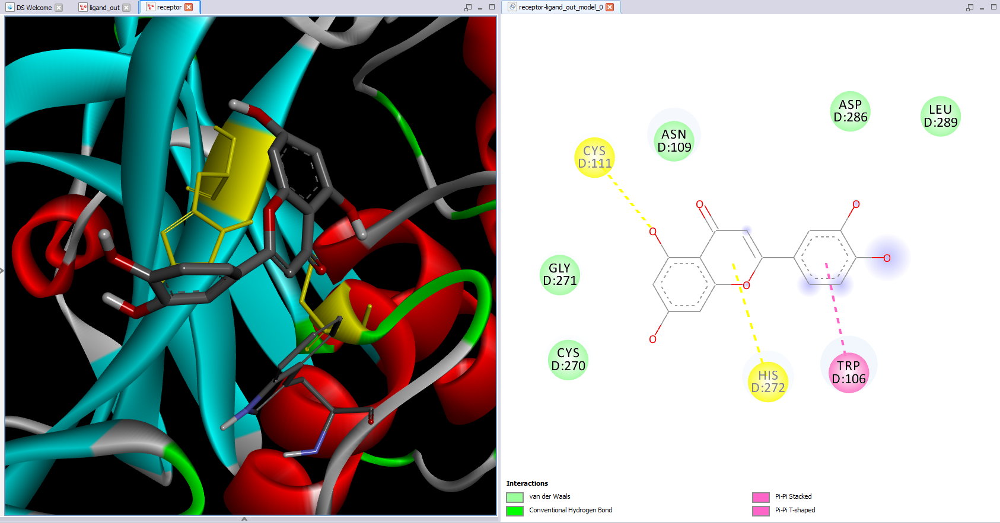
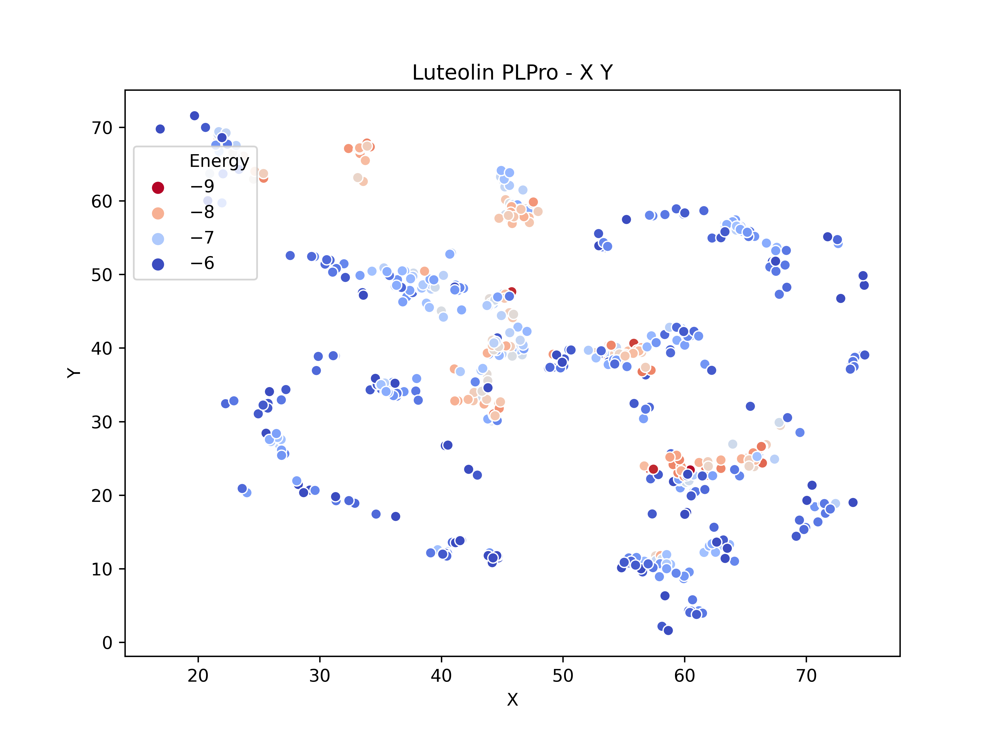

# Docking-Molecular
Repositório com algoritmos e notebooks de docking molecular.

# *Diário de Bordo* 

## *04/11* 
A partir de hoje começo um diário de bordo narrando parte do meu trabalho no projeto de docking molecular. Alguns códigos já foram criados antes do início desse diário, porém pretendo apresentar isto posteriormente.
Hoje, vou começar apresentando o resultado de um docking que eu fiz na PLPro do vírus Sars-Cov-2 utilizando o fármaco Luteolin, que a priori é um ligante que apresentou bons resultados nos artigos que eu li. 
Segundo o artigo "The SARS-coronavirus papain-like protease: Structure, function and inhibition by designed antiviral compounds" o sítio ativo do SARS-CoV-1 fica localizando na região Cys112–His273–Asp287, então o docking será feito nessa região. Perceba que, esse não é o SARS-CoV-2, mas sim um vírus anterior muito parecido com esse da epidemia de 2020.
Para consulta posterior, ultilizando o AutodockVina tomei exhaustiveness = 100. Proteína PDB 6wuu.

O resultados foram,

| mode \| | affinity          | dist from  | best mode |
|---------|-------------------|------------|-----------|
|      \| | energy (kcal/mol) | rmsd l.b.  | rmsd u.b. |
| 1       | -6.0              | 0.000      | 0.000     |
| 2       | -6.0              | 2.575      | 3.445     |
| 3       | -5.9              | 1.663      | 2.598     |
| 4       | -5.8              | 2.224      | 6.407     |
| 5       | -5.7              | 2.012      | 2.303     |
| 6       | -5.6              | 2.461      | 6.063     |
| 7       | -5.6              | 2.265      | 6.027     |
| 8       | -5.6              | 1.296      | 1.599     |
| 9       | -5.4              | 2.849      | 4.265     |

Vamos analisar o primeiro modo.

Temos duas ligações no sítio ativo porém a energia de ligação é muito baixa.
Para continuar vamos fazer um docking em várias partes da proteína e avaliar se existem outras posições em que a ligação pode ser realizada com um melhor gasto de energia. Para isso irei utilizar o algoritmo "Algoritmo Simulações AutoDock Vina"

## *05/11* 
Durante a noite eu deixei meu PC rodando o docking em várias partes da proteína e levou cerca de uma hora para completar o processo. Com isso utilizei um notebook para realizar a análise desses dados, foram 3362 de resultados.

|      |         x |         y |         z |      RMSD | Energy |
|-----:|----------:|----------:|----------:|----------:|-------:|
| 1932 | 60.485769 | 23.419552 | 18.576984 |  0.000000 |   -8.9 |
| 1941 | 60.464784 | 23.426756 | 18.555649 |  0.040864 |   -8.9 |
| 1933 | 57.437527 | 23.533292 | 16.284492 |  7.519324 |   -8.8 |
| 1761 | 45.786486 | 47.644405 | -8.122137 | 39.249817 |   -8.8 |
| 2058 | 55.825401 | 40.619856 | 28.457556 | 20.667280 |   -8.7 |

Como podem ver existe uma região de mínimo para a energia, porém não é no sítio ativo, tomei o melhor desempenho energético como o referencial para o cálculo do RMSD. A energia nessa região de mínimo chega a ser 50% menor que a energia no sítio ativo, aparentemente o ligante não é bom para a PLPro. Porém, vamos continuar com a nossa análise.

Filtrando os dados <= -6.0 Kcal/mol ploto um scatterplot para visualizar a dispersão dos dados. Abaixo temos o plot para XY.

Como podem ver existe uma vasta região com energias próximas a -6.0. O sítio ativo da proteína fica na região x, y, z = 46, 35, 38. Em regiões próximas existem lugar com uma melhor afinidade energética.

Além disso, realizei duas clusterizações dos dados uma ultilizando o KMeans e outra com o DBSCAN. Utilizei o DBSCAN, pois é desconsiderado pontos muito foca do cluster, tais pontos são tratados como ruído. Por fim, normalizei os dados para que todos tenham o mesmo peso, ou seja, as coordenadas x, y e z, energia e RMSD possuem o mesmo peso na hora de calculas os clusters. Creio que a priori é a melhor forma, pois existem valores de RMSD muito altos que porem prejuticas os algoritmos de cluster.

