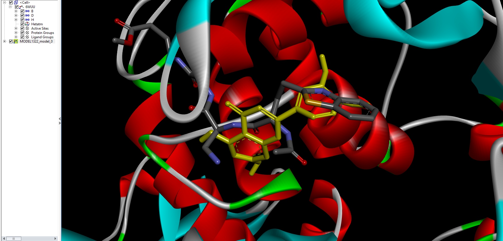

# Docking-Molecular
Repositório com algoritmos e notebooks de docking molecular.

# *Diário de Bordo* 

## *04/11* 
A partir de hoje começo um diário de bordo narrando parte do meu trabalho no projeto de docking molecular. Alguns códigos já foram criados antes do início desse diário, porém pretendo apresentar isto posteriormente. Hoje, vou começar apresentando o resultado de um docking que eu fiz para a proteína PLPro do vírus Sars-Cov-2 utilizando o fármaco Luteolin (https://pubchem.ncbi.nlm.nih.gov/compound/Luteolin), que a priori é um ligante que apresentou bons resultados nos artigos que eu li. Segundo o artigo "The SARS-coronavirus papain-like protease: Structure, function and inhibition by designed antiviral compounds" (https://doi.org/10.1016/j.antiviral.2014.12.015) o sítio ativo do SARS-CoV-1 fica localizando na região Cys112–His273–Asp287, então o docking será feito nessa região. Perceba que, esse não é o SARS-CoV-2, mas sim um vírus anterior (SARS-Cov-1) de 2002 muito parecido com esse da epidemia de 2020. Para consulta posterior, utilizando o AutodockVina tomei exhaustiveness = 100. Proteína PDB 6wuu (https://www.rcsb.org/structure/6WUU).

Os resultados foram,

| mode \| | affinity          | dist from  | best mode |
|---------|-------------------|------------|-----------|
|      \| | energy (kcal/mol) | rmsd l.b.  | rmsd u.b. |
| 1       | -6.0              | 0.000      | 0.000     |
| 2       | -6.0              | 2.575      | 3.445     |
| 3       | -5.9              | 1.663      | 2.598     |
| 4       | -5.8              | 2.224      | 6.407     |
| 5       | -5.7              | 2.012      | 2.303     |
| 6       | -5.6              | 2.461      | 6.063     |
| 7       | -5.6              | 2.265      | 6.027     |
| 8       | -5.6              | 1.296      | 1.599     |
| 9       | -5.4              | 2.849      | 4.265     |

Vamos analisar o primeiro modo (repare que houve um shift, uma subtração de menos um na numeração dos aminoácidos).

Temos duas ligações no sítio ativo, porém a energia de ligação é muito baixa.
Para continuar vamos fazer um docking em várias partes da proteína e avaliar se existem outras posições em que a ligação pode ser realizada com um melhor gasto de energia. Para isso irei utilizar o algoritmo "Algoritmo Simulações AutoDock Vina" https://github.com/rafaelpleite/Docking-Molecular/blob/main/SimularAutodock.py .

## *05/11* 
Durante a noite eu deixei meu PC rodando o docking em várias partes da proteína e levou cerca de uma hora para completar o processo. As configurações do meu PC são: Ryzen 1600AF; 8 GB de ram DDR4; RX 570 8GB.
Com isso utilizei um notebook para realizar a análise desses dados, foram 3362 de resultados.

|      |         x |         y |         z |      RMSD | Energy |
|-----:|----------:|----------:|----------:|----------:|-------:|
| 1932 | 60.485769 | 23.419552 | 18.576984 |  0.000000 |   -8.9 |
| 1941 | 60.464784 | 23.426756 | 18.555649 |  0.040864 |   -8.9 |
| 1933 | 57.437527 | 23.533292 | 16.284492 |  7.519324 |   -8.8 |
| 1761 | 45.786486 | 47.644405 | -8.122137 | 39.249817 |   -8.8 |
| 2058 | 55.825401 | 40.619856 | 28.457556 | 20.667280 |   -8.7 |

Como podem ver existe uma região de mínimo para a energia, porém não é no sítio ativo, tomei o melhor desempenho energético como o referencial para o cálculo do RMSD, ou seja, o ligante 1932 da tabela acima. A energia nessa região de mínimo chega a ser 50% menor que a energia no sítio ativo, aparentemente o ligante não é bom para a PLPro. Porém, vamos continuar com a nossa análise.

Filtrando os dados <= -6.0 Kcal/mol ploto um scatterplot para visualizar a dispersão dos dados. Abaixo temos o plot para XY.

Como podem ver existe uma vasta região com energias próximas a -6.0. O sítio ativo da proteína fica na região x, y, z = 46, 35, 38.

Ademais, para continuar a análise implementei umas nova funcionalidades ao notebook. A primeira é a visualização da distribuição de pontos em 3d com o plotly, com isso é possível obter uma melhor visualização da distribuição das energias em relação a distribuição espacial como na imagem abaixo.

Porém, é visível que existem regiões próximas com uma melhor afinidade energética, então implementei outra nova funcionalidade para selecionar uma caixa em um intervalo do meu DataFrame determinado por um array 3x2, ie, [[x0, x1],[y0, y1],[z0, z1]] para uma análise mais apurada dos resultados. Após isso, foi possível visualizar que existe uma região próxima do sítio ativo com melhores resultados, por exemplo uma das simulações gerou um resultado com centro de massa no ponto x, y, z = 53.89, 40.30, 28.81 com energia de -8.2. Abaixo vai o gráfico obtido com essa implementação,

Além disso, realizei duas clusterizações dos dados uma utilizando o KMeans e outra com o DBSCAN. Utilizei o DBSCAN, pois é desconsiderado pontos muito fora do cluster, tais pontos são tratados como ruído. Por fim, normalizei os dados para que todos tenham o mesmo peso, ou seja, as coordenadas x, y e z, energia e RMSD possuem o mesmo peso na hora de calculas os clusters. Creio que a priori é a melhor forma, pois existem valores de RMSD muito altos que porem prejudicar os algoritmos de cluster, mas preciso me aprofundar mais nessa questão. Aqui vai os resultados.

Comparando com o gráfico "Luteolin PLPro - X Y" no começo do diário 05/11 é difícil tirar alguma informação importante de ambos os clusters, talvez eu precise implementar os algoritmos de cluster de uma melhor forma priorizando a energia, ou talvez considerar os eixos das coordenas como uma esfera de raio, r^2 = x^2 + y^2 + z^2 com origem no sítio ativo. Isso será analisado e em breve divulgarei uma forma melhor de fazer isso.

Por fim, aparentemente os resultados para o docking do Luteoin na PLPro são inconsistentes, pois os valores energéticos são piores quando comparados com outras regiões além do sítio ativo.

Fica aqui algumas ideias de algoritmos para facilitar o trabalho com os dados: 

Criar um único arquivo .pdqbt com os resultados;

Encontrar uma melhor maneira de clusterizar o resultados;

Aprimorar as funções que analisam .pdbqt para não precisarem do número de átomos;

Plotar a proteína com o ligante pelo notebook usando bibliotecas de biologia computacional;

Criar um gui para outras pessoas poderem interagir com os algoritmos;

Procurar uma forma de usar CPU e GPU para os cálculos com o Vina ao invés de apenas CPU;

## *12/11* 
Hoje eu implementei um algoritmo chamado "joinpdbqt.py" que recebe um diretório, lê todos os arquivos .pdbqt e retorna apenas um arquivo .pqdbt. O código ficou muito bem escrito, creio que o uso do enumerate ajudou o código a fica com um bom clean code. Além do mais, como essa semana está corrida não consiguirei me dedicar muito ao projeto, mas a partir daqui vou tentar analisar de forma mais profunda os resultados do docking da semana passada.
Na análise da semana passada tudo parecia perdido, o resultado enégico para o sítio ativo estava péssimo. Então após conversar com o professor Marcos resolvi olhar para o ligante que vem junto com a proteína PLPRO que é chamada de 6WUU no site Protein Data Bank que é o VIR 250. Procurando um resultado de docking proxímo a esse sítio obtive o seguinte resultado para de interação.

A figura da esquerda representa o ligante VIR250, enquanto que a da direita é o Luteolin. Perceba que ele interage com os aminoácidos MET208 e ASP164. O resultado da direita obteve um valor energético -7.7, melhor que para o resultado estudando no sítio ativo de -6.0.

Em amarelo temos o Luteoin e o outro é o VIR250, perceba que estão bem próximos.

A priori isso pode representar algum avanço, porém preciso analisar melhor esse resultado e também encontrar alguma forma de encontrar um resultado melhor realizando mais dockings nesta região.

## *26/11*
Esse semana acrescentei no diário de bordo alguns links e editei alguns textos para que fiquem mais claros.
Também, arrumei o códio joinpdqbt.py https://github.com/rafaelpleite/Docking-Molecular/blob/main/joinpdbqt.py, pois o mesmo dava erro quando havia uma sub pasta com arquivos .pdbqt dentro do diretório passado dentro do programa. Para fazer isso adicionei uma linha chamada "if root == path:" que garante que apenas a pasta passada na variável path será analisa e sub pastas serão ignoradas pelo programa.

Implementar vizualização 3d de cluster.
Gera pdbqt com nome.
Implementar alguma forma de vizualizar os resultados da proina + ligante por notebook.
Dinamica molecular.
Estudar smina.

<iframe width="900" height="800" frameborder="0" scrolling="no" src="//plotly.com/~rafael.pleite/1.embed"></iframe>

<!DOCTYPE html>

<html lang="en" xmlns="http://www.w3.org/1999/xhtml">
<head>
    <title>Welcome</title>
</head>
<body>
    <h1>Django Site</h1>
    

    
Thanks for visiting.

</body>
</html>

